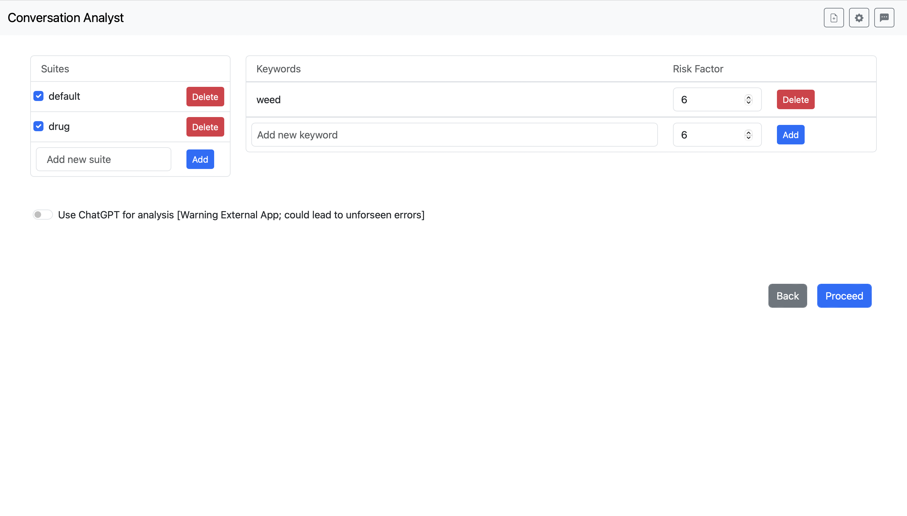

# Conversation analyst

To get this code running require steps for set up

# Step 1 install python and pip
You need to have Python 3.11 installed on your system. If you haven't installed it yet, you can download it from the [official Python website](https://www.python.org/downloads/) and follow the installation instructions for your operating system.

To verify if pip is installed, you can run the following command in your terminal or command prompt:

    pip --version

# Step 2 clone the repo

    git clone https://github.com/IsaacG18/conversation-analysis.git

# Step 3 set up venv

    pip install virtualenv

Navigate to your project directory in the terminal or command prompt and run the following command to create a virtual environment named 'ca':

    virtualenv ca

**On Windows:**

    ca\Scripts\activate

**On macOS and Linux:**

    source ca/bin/activate

# Step 4 add .env

File path: conversation-analysis/tp3/tp3 **create a file** called **.env**

Add in the file

    CHATGPT_API_KEY=<api-key>
    CHATGPT_VERSION=<model-version>

Current version is gpt-3.5-turbo
If the key needs updated the .env and re-run Step 7

# Step 5 install packages
File path: conversation-analysis/
**Using Init Script**
You can skip Step 5 and 6 using

    chmod +x init.sh

    ./init.sh

Or for windows

    init.bat

**For manual install:**
**Window OS:**

    pip install -r win_requirements.txt

**Other OS:**

    pip install -r requirements.txt

# Step 6 run these commands
Create and run the migrations 
File path: conversation-analysis/tp3:

    python manage.py makemigrations
    
    python manage.py migrate
    
    python manage.py migrate --run-syncdb

Run the populate script

    python date_format_populate.py

# Step 7 After set up to run the website uses this command
File path: conversation-analysis/tp3

    python manage.py runserver

# To test the speed of the code run this in linux
File path: conversation-analysis/tp3
    
    time python speed_test_messages.py

To run the file 100 times do this

    time (for i in {1..100}; do python speed_test_messages.py; done)

# Versions

  

**1.0.0**
Available from the 15th of January
Access original only on Python Anywhere

Core Feature:
- NLP
  - Sentiment Analysis (not integrated)
  - Added Visualization for messages
  - Keyword Identification
  - Name and Location identification
- Data ingestion
  - Basic Customization of File ingestion
  - Custom Keywords (only in settings)
  - Compatibility with csv, docs, and txt
  - Error Handling in upload
- Front End
  - Search homepage for files
  - Word highlighting in content review
  - Date Filtering 
  - Key Highlighting
- ChatGPT
  - Nothing Implemented
  
**2.0.0**
Available from the 15th of February, available as github and website
- Content Review New features
  - Google Maps API search
  - Export XML data
  - Add re-analysis of file
- ChatGPT new features
  - Added the ability to message chatgpt
  - Added ability to create new chats
  - Added ability to access old chats
  - Added suggested prompts based on analysis
- Other new features
  - Renaming analysis on homepage
- Improvements to existing features
  - Search for root words in analysis
  - Improved customization in file structure including; dates, types order, and ability to added extra delimiters

**2.1.0**
Available from the 14th of March, available as github and website
- Visual updates
  - Content Review Page
  - ChatGPT page
  - Waiting message for data analysis 
- New features
  - ChatGPT summary
  - Search bar on chatgpt page
  - Allow the renaming of chats
  - Customsation of risk levels
  - Increased naviation between chatgpt page and content review
  - Allow chatgpt to find names and locations
  - Ability to delete old analysis
  - Ability to select to skip a line as title line
- Other improvements
  - Cleaner code
  - Increase testing
  - Bug fixes on display html in chats
  - Filter out emojis from names
  - Less files stored on machine

# Get Started

**- What can you do with the website**
	- upload chat logs
	- receive analysis of the chat logs
	- tailor analysis with customise settings
	- download analysis as XML files
	- get boosted from external APIs
**- Upload files**

	- upload file with the 'upload' button at the right end of the navigation bar
	- adjust delimiter settings according to the format of your files
	- reorder the delimiters by input numbers. For example, if each message of you file starts from a timestamp, the order number of component 'Timestamp' should be set to 1
	- choose timestamp format used by your chat file
	- enable 'Skip First Line' if the first line of your chat log is a title
**- Customise keywords**

	- messages with keywords would be highlighted in the analysis
	- keywords are grouped into suites
	- selected suites would be applied to the file analysis
	- add keywords to suites and assign risk factors
	- risk factors ranges from 0-10
	- keywords with risk factor = 0 wouldn't show up in analysis, might be useful if you want to disable some keywords temporarily
	- Person and Locations are identified by SpaCy models by default. Turn on 'Use ChatGPT for analysis' if you'd like ChatGPT to do it instead
**- File Management**

	- double click on file to rename it
	- delete file by clicking '×' button to the right of the file name
	- search for file names using the search bar
	- files are ordered by upload date
**- More settings**

	- access settings with the 'setting' button at the right end of the navigation bar
	- you could update keywords in settings, as well as in the process of upload file
	- 'Detection' section allow you to adjust thresholds for risk detection
	- 'Strictness' accounts for the threshold are message is marked as risky
	- setting 'Strictness' to 'Off' would disable message risk calculation
	- 'Sentiment' controls the impact of sentiment analysis in message risk calculation
	- setting 'Sentiment' to 'Off' would disable sentiment analysis in risk calculation process
**- Content Review**

	- sender, message content will be shown on the left side
	- 'Regenerate' allows to re-analyse the file with different keywords, GPT and strictness settings
	- 'Download XML' generates XML files for the analysis, i.e. everything on the right side of the page
	- 'Summarise' asks ChatGPT to summarise the chat for you (to use this feature, an OpenAI key need to be provided first, see 'Step 4 add .env' in README.md and 'GPT troubleshooting' section for details)
	- buttons in 'Risk Level' section filters messages based on calculated risk for each message
	- hover on buttons in 'Person' and 'Location' highlights them in the chat, and clicking on them filters out messages containing them for you
	- use 'Date/Time Filter' to view messages in a certain period
	- 'Visualisation' shows a graph Plotting each participant's message length against timeline
**- Get help from ChatGPT**

	- start a chat with GPT by clicking on 'New ChatGPT' button from an analysis
	- 'Existing ChatGPT' shows the chat you already started with ChatGPT
	- there's a list of prompts on the right to make things easier
	- past chats are listed on the left hand side
	- double click on chats to rename them
	- search chats with their names
	- 'Go to file' button brings you back to the analysis
**- GPT troubleshooting**
	- if you are getting 'An error occurred: The api_key client option must be set either by passing api_key to the client or by setting the OPENAI_API_KEY environment variable', please double check if you have .env set up in the correct folder
	- if you are getting errors like:  OpenAI API returned an API Error: Error code: 401 - {'error': {'message': 'Incorrect API key provided: <your api key> You can find your API key at https://platform.openai.com/account/api-keys.', 'type': 'invalid_request_error', 'param': None, 'code': 'invalid_api_key'}}, please double check the key you provided in .env is correct and try restart the server